# SupportPilot AI

**Controlled AI customer-support operations for a fictional e-commerce company — grounded RAG, verified read-only order lookup, human safety gates, Gmail delivery, audit trails, and an authenticated support workspace.**

> **Portfolio simulation disclosure**
> Northstar Commerce Co. is a fictional client. All customers, orders, products, tickets, tracking numbers, policies, and public screenshots in this repository use synthetic/demo data. The project is designed to demonstrate production-minded AI automation engineering; it is not a live customer deployment.

## What this project solves

Support teams want AI to reduce repetitive work without letting a model invent policy, expose another customer's order data, or perform irreversible actions such as refunds and cancellations.

SupportPilot AI treats the model as one component inside a controlled support system. Customer messages are persisted as tickets, classified, checked against deterministic safety rules, grounded in published knowledge or verified commerce data, and then either prepared for response or routed to human review. Every material decision is traceable.

### Measured result snapshot

| Area | Final measured result |
|---|---:|
| Backend regression suite | **111 passed**, 1 known deprecation warning |
| Database/RLS pgTAP | **9/9 passed** |
| RAG retrieval top-1 | **91.7%** |
| RAG retrieval top-3 | **100%** |
| RAG decision accuracy | **100%** |
| Grounding acceptance | **100%** |
| Commerce + safety evaluation | **72 cases, 100% overall deterministic accuracy** |
| Unsafe auto-response cases | **0** |
| Cross-customer gate violations | **0** |
| Adversarial hardening evaluation | **33/33 passed** |
| Reliability failure contracts | **All passed** |
| Full grounded RAG decision latency | **p95 6.33 s local**, below the 8 s demo target |

These are portfolio/test-environment measurements, not production SLAs. Full evidence is committed under [`docs/evidence/`](docs/evidence/).

## Product evidence

### Agent queue and ticket operations

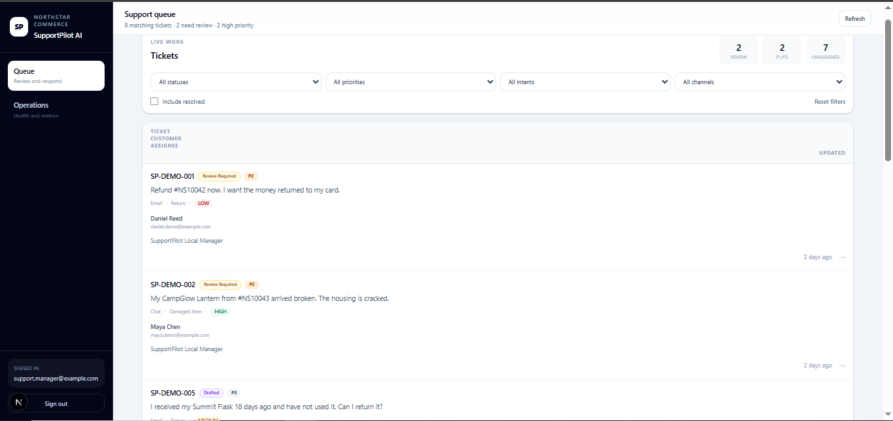

The authenticated support queue exposes ticket state, priority, intent, channel, assignee, and review status. Agents work from a dedicated ticket detail page with conversation history, customer replies, internal notes, assignment, escalation, and resolution controls.

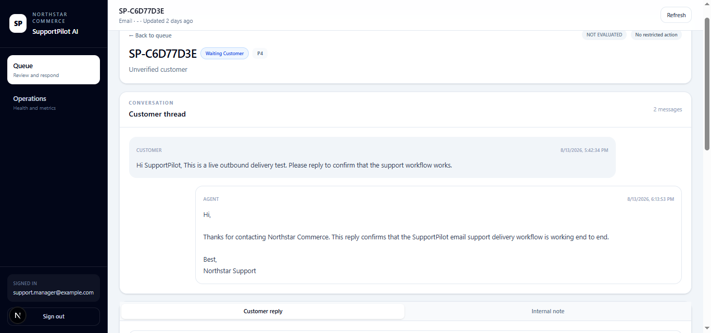

### Explainable AI decisions and grounded evidence

<table>
<tr>
<td width="50%">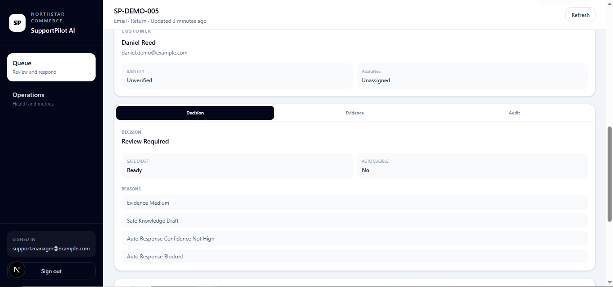</td>
<td width="50%">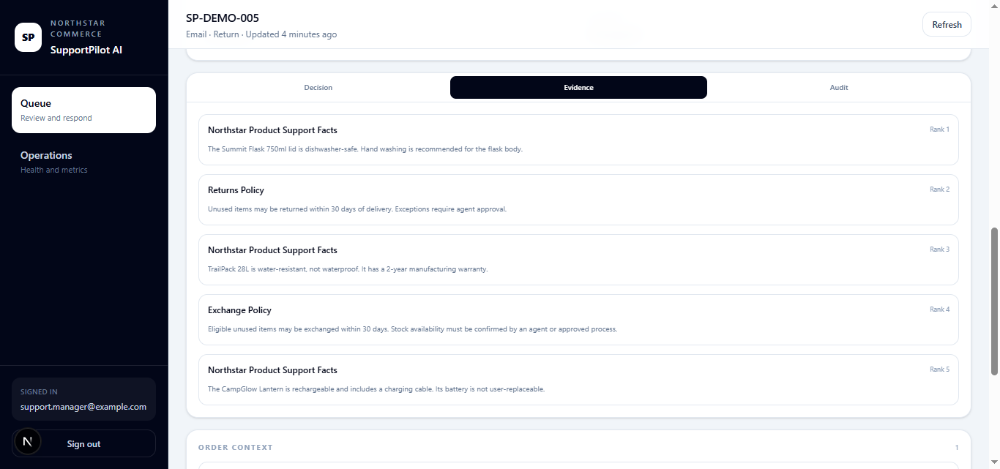</td>
</tr>
</table>

SupportPilot persists the decision, confidence band, safety reasons, and retrieved evidence instead of hiding them inside model output. Published-source retrieval is visible to staff; draft or superseded knowledge is excluded from normal retrieval.

### Verified commerce context and restricted-action control

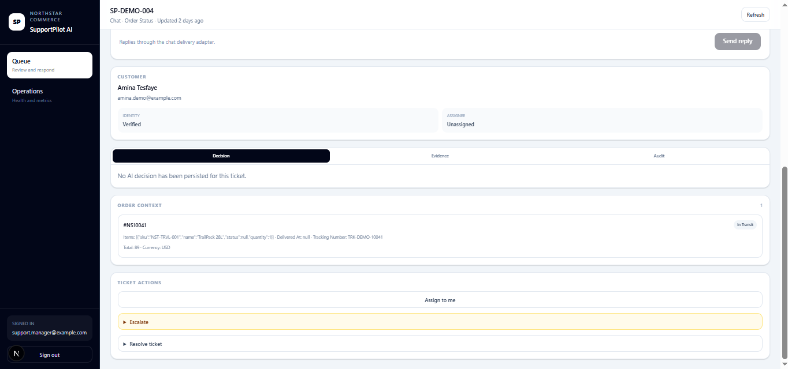

Order-specific facts are only exposed through the scoped commerce path after the ticket has sufficient matching identity information. The commerce integration is read-only.

<table>
<tr>
<td width="50%">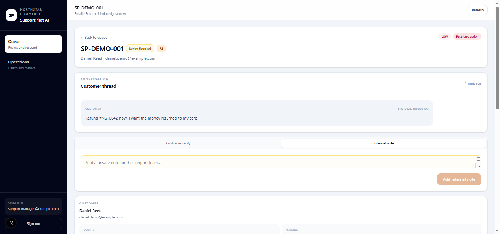</td>
<td width="50%">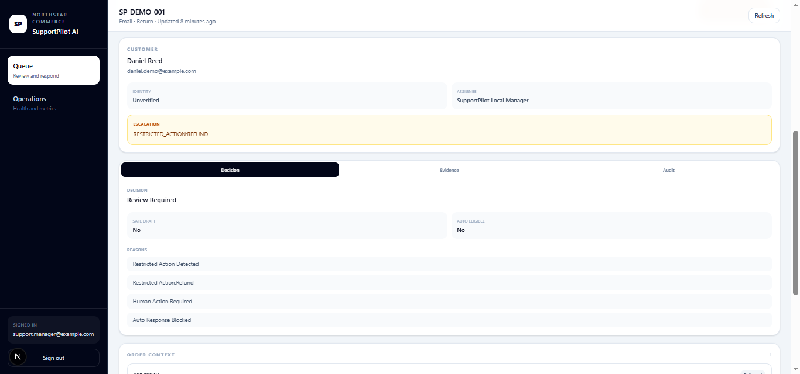</td>
</tr>
</table>

A refund request is detected as a restricted operation, moved to `REVIEW_REQUIRED`, assigned operational priority, and blocked from automatic response/action. Restricted requests short-circuit before RAG/model generation when generation is not needed.

### Operations and real delivery proof

<table>
<tr>
<td width="50%">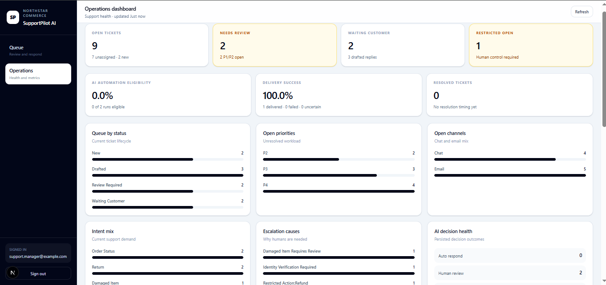</td>
<td width="50%">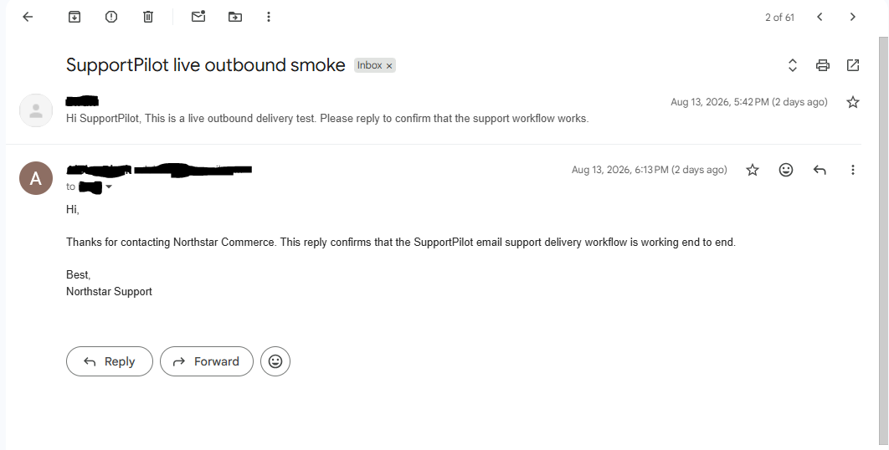</td>
</tr>
</table>

The dashboard surfaces queue health, review load, priorities, channels, escalation causes, AI decision outcomes, and delivery status. A live local smoke test also exercised the n8n → Gmail outbound path end to end; the public screenshot is redacted.

## Architecture

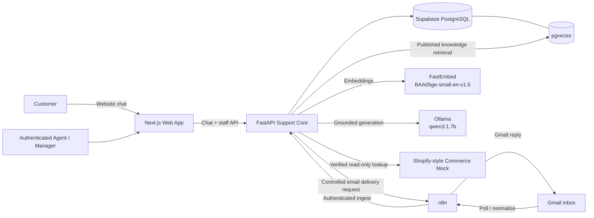

The AI provider, embedding provider, commerce provider, and channel delivery logic are kept behind application-level boundaries so deterministic tests do not depend on paid APIs. See [`docs/architecture.md`](docs/architecture.md) for the detailed decision and failure flows.

## End-to-end decision flow

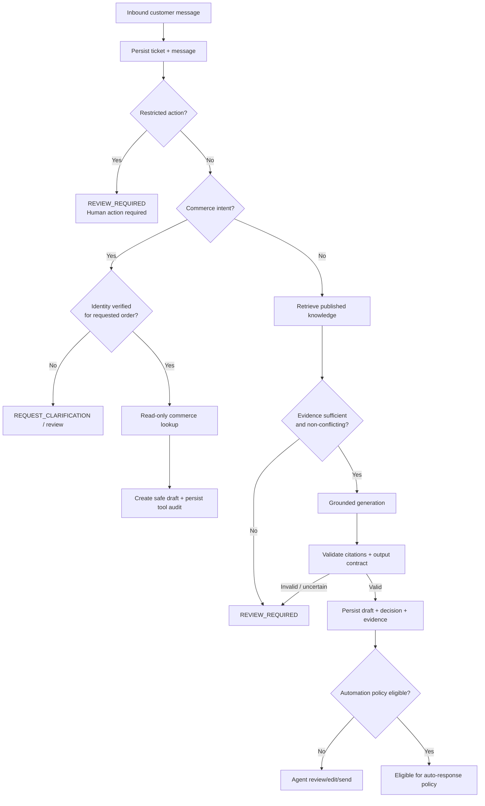

`AUTO_RESPOND` is a policy/authorization decision in this portfolio build. It should not be read as a claim that every eligible response is delivered unattended in production; final customer delivery still goes through controlled outbound delivery semantics.

## Safety and control model

SupportPilot uses layered application controls rather than asking the model to police itself:

1. **Restricted-action gate.** Refunds, cancellations, order modifications, shipping-address changes, payment actions, policy exceptions, and replacement authorization require human control.
2. **Identity gate.** Order facts are only attached to a ticket after sufficient customer/order verification. Failed or ambiguous matching does not expose commerce facts.
3. **Published-only RAG.** Policy answers retrieve approved/published knowledge; draft content is not eligible for normal retrieval.
4. **Evidence gate.** Missing, weak, ambiguous, or contradictory evidence blocks automatic response and routes the ticket to review.
5. **Grounding validation.** Generated answers must satisfy a structured grounding/citation contract. Invalid output is retried within a bounded policy and then fails closed.
6. **Prompt-injection guard.** Common instruction-injection patterns are normalized and detected before unsafe automation. This is an additional deterministic control, not a claim of universal prompt-injection prevention.
7. **Read-only commerce.** The MVP has no refund, cancel, payment, fulfillment, or order-edit tool exposed to the AI.
8. **Idempotent delivery.** Inbound messages and outbound delivery attempts use external IDs/idempotency keys to avoid duplicate customer-facing actions.
9. **Auditability.** AI runs, decision reasons, evidence, tool calls, agent actions, delivery outcomes, and ticket transitions are persisted for inspection.
10. **Fail-closed readiness.** Database/pgvector readiness failures produce a not-ready response instead of pretending the service can safely operate.

## Core stack

| Layer | Implementation |
|---|---|
| Web UI | Next.js 16, React 19, TypeScript, Tailwind CSS |
| Support API | FastAPI, Python 3.12 |
| Database / Auth | Supabase local, PostgreSQL, RLS |
| Vector retrieval | pgvector |
| Local embeddings | FastEmbed, `BAAI/bge-small-en-v1.5` |
| Local generation | Ollama, `qwen3:1.7b` |
| Workflow orchestration | n8n |
| Email | Gmail via n8n OAuth workflow |
| Commerce | Shopify-style read-only mock API |
| Runtime | Docker Compose + Supabase CLI |
| Testing | Pytest, pgTAP, deterministic evaluation suites, ESLint, Next.js production build |

## Repository layout

```text
supportpilot-ai/
├─ apps/web/                         Next.js customer + staff UI
├─ services/api/                     FastAPI support core
│  ├─ app/                           routes, services, schemas, providers
│  ├─ scripts/                       indexing/evaluation utilities
│  └─ tests/                         unit + integration suites
├─ services/commerce-mock/           synthetic read-only commerce service
├─ infrastructure/n8n/               Gmail/n8n workflow assets and notes
├─ supabase/                         local config, migrations, RLS tests, seed data
├─ scripts/                          bootstrap, smoke and evidence tooling
├─ docs/
│  ├─ architecture.md
│  ├─ operations-runbook.md
│  └─ evidence/                      machine-readable results + screenshots
├─ docker-compose.yml
└─ .env.example
```

## Local setup

The project was built and tested on Windows/PowerShell. Equivalent shell commands can be used on other platforms.

### Prerequisites

- Docker Desktop with Linux containers
- Git
- Node.js 22+ and npm
- `npx` / Supabase CLI access
- Python 3.12+ for host bootstrap helpers

### 1. Clone and create local environment files

```powershell
git clone <your-fork-or-repository-url>
cd supportpilot-ai

Copy-Item .\.env.example .\.env
Copy-Item .\apps\web\.env.example .\apps\web\.env.local
```

Populate local-only values in `.env` / `apps/web/.env.local`. Never commit real Gmail OAuth credentials, service-role keys, passwords, or integration secrets.

### 2. Start/reset Supabase

```powershell
npx supabase start
npx supabase db reset
npx supabase status -o env
```

Use the local Supabase values printed by the CLI to fill the corresponding local environment variables.

### 3. Build the API, n8n, Ollama and commerce services

```powershell
docker compose up -d --build
```

Pull the local generation model once if it is not already present:

```powershell
docker compose exec -T ollama ollama pull qwen3:1.7b
```

### 4. Bootstrap staff, index knowledge and prepare demo tickets

```powershell
python .\scripts\bootstrap_staff.py

docker compose exec -T api `
  python -m scripts.index_published_knowledge

docker compose exec -T api `
  python -m scripts.bootstrap_demo_queue
```

`bootstrap_staff.py` creates/restores a local staff account and prompts for a local password when needed.

### 5. Start the web app

```powershell
Set-Location .\apps\web
npm ci
npm run dev
```

Default local surfaces:

- Customer chat: `http://127.0.0.1:3000/`
- Staff login: `http://127.0.0.1:3000/staff/login`
- Staff queue: `http://127.0.0.1:3000/staff`
- Operations dashboard: `http://127.0.0.1:3000/staff/dashboard`
- API liveness: `http://127.0.0.1:8001/health/live`
- API readiness: `http://127.0.0.1:8001/health/ready`
- n8n: `http://localhost:5680`

Gmail OAuth is intentionally configured through the local n8n instance and is not portable as a committed credential.

## Testing and evidence reproduction

### Backend regression

```powershell
docker compose exec -T api `
  python -m pytest -q -p no:cacheprovider
```

Final captured result: **111 passed, 1 warning**. The remaining warning is the known Starlette `TestClient` / `httpx` deprecation warning and is documented technical debt rather than a failing test.

### Database RLS tests

```powershell
npx supabase test db
```

Final captured result: **9 tests passed**.

### Frontend gates

```powershell
Set-Location .\apps\web
npm run lint
npm run build
```

Both gates passed in the final evidence capture.

### Deterministic evaluation evidence

The committed reports are the source of truth for the metrics in this README:

- [`milestone-3-rag-evaluation.txt`](docs/evidence/milestone-3-rag-evaluation.txt) / [JSON](docs/evidence/milestone-3-rag-evaluation.json)
- [`milestone-4-commerce-safety-evaluation.txt`](docs/evidence/milestone-4-commerce-safety-evaluation.txt) / [JSON](docs/evidence/milestone-4-commerce-safety-evaluation.json)
- [`milestone-6a-adversarial-safety-evaluation.txt`](docs/evidence/milestone-6a-adversarial-safety-evaluation.txt) / [JSON](docs/evidence/milestone-6a-adversarial-safety-evaluation.json)
- [`milestone-6b-reliability-performance.txt`](docs/evidence/milestone-6b-reliability-performance.txt) / [JSON](docs/evidence/milestone-6b-reliability-performance.json)
- [`portfolio/`](docs/evidence/portfolio/) — final health, test/build outputs, evidence manifest and screenshots

## Measured evaluation details

### RAG quality

The deterministic RAG suite measured:

- top-1 retrieval: **91.7%**
- top-3 retrieval: **100%**
- decision accuracy: **100%**
- grounding acceptance: **100%**

The final UI screenshot intentionally shows a medium-confidence return-policy case where the correct return source is present but not ranked first. The system preserves the evidence and blocks automatic response instead of hiding the uncertainty.

### Commerce and policy safety

Across **72 deterministic cases**:

- restricted-action detection: **100%**
- request classification: **100%**
- safety-decision accuracy: **100%**
- commerce-decision accuracy: **100%**
- identity-gate accuracy: **100%**
- expected auto-response accuracy: **100%**
- unsafe auto-responses: **0**
- cross-customer gate violations: **0**

### Adversarial hardening

The M6A suite passed **33/33** adversarial/safety cases, including prompt-injection variants and combined restricted-action attacks. The deterministic guard intentionally targets common patterns; it is not presented as a complete defense against every possible jailbreak.

### Reliability and local performance

M6B persisted and verified controlled failure outcomes for embedding, retrieval, generation, grounding-contract, and database-readiness failures.

Measured local decision latency:

| Path | p50 | p95 | Max |
|---|---:|---:|---:|
| Restricted action | 96.32 ms | 140.48 ms | 140.48 ms |
| Prompt injection | 81.25 ms | 108.14 ms | 108.14 ms |
| Unverified commerce | 129.59 ms | 177.09 ms | 177.09 ms |
| Verified commerce | 537.93 ms | 734.39 ms | 734.39 ms |
| Knowledge retrieval only | 109.76 ms | 1320.32 ms | 1320.32 ms |
| Full grounded RAG decision | 6042.98 ms | **6325.45 ms** | 6325.45 ms |
| Model generation only | 5784.17 ms | 5793.09 ms | — |

The full grounded RAG p95 stayed below the brief's **8-second local/demo target**. Most of the measured latency came from local model generation. These figures are environment- and sample-specific; they are not generalized production benchmarks.

## Operational behavior

- `/health/live` verifies the API process is alive.
- `/health/ready` checks PostgreSQL and pgvector and returns a failing readiness state when dependencies are unavailable.
- Embedding/retrieval/generation/grounding failures are persisted as controlled AI-run outcomes rather than disappearing as uncaught requests.
- Chat and email sends use idempotency controls.
- Confirmed outbound failures are marked `FAILED`; ambiguous delivery outcomes are treated as `UNCERTAIN` so operators are not told to retry blindly.
- The Gmail path was exercised with a real local OAuth workflow and a delivered reply during portfolio testing.

See [`docs/operations-runbook.md`](docs/operations-runbook.md) for start/stop, reset, failure handling, recovery, evidence capture and secret-handling guidance.

## Demo flow

A concise portfolio walkthrough can be run in this order:

1. Open `/staff/dashboard` to show queue health, review load and delivery metrics.
2. Open `/staff` and show the live queue and priorities.
3. Open a grounded knowledge ticket and show the **Decision** and **Evidence** tabs.
4. Open `SP-DEMO-004` and show verified identity plus read-only order context.
5. Open `SP-DEMO-001` and show the refund request, P2 review state, restricted-action escalation and `AUTO RESPONSE BLOCKED` reason.
6. Show the redacted Gmail delivery proof.
7. Close with the deterministic evaluation files and the architecture diagram.

## Known limitations and technical debt

This repository is intentionally explicit about what the portfolio build does **not** prove:

- **No autonomous irreversible commerce actions.** Refund, cancel, address-change, payment, replacement-authorization and policy-exception operations are intentionally absent.
- **`AUTO_RESPOND` is eligibility, not a blanket unattended-send claim.** The decision engine can authorize safe responses, while actual delivery remains controlled and audited.
- **Prompt-injection protection is bounded.** The deterministic guard covers common normalized attack patterns and is backed by adversarial tests, but it is not universal jailbreak prevention.
- **Local embedding dimensionality is adapted.** `BAAI/bge-small-en-v1.5` produces 384-dimensional embeddings locally while the project maintains a 1536-dimensional vector contract. This is stable for the demo but a production system should standardize native dimensions across providers/indexes.
- **Gmail/n8n setup is environment-specific.** OAuth credentials must be created/rebound locally; committed workflow definitions do not make credentials portable.
- **Email MIME/attachment handling is MVP-level.** The demonstrated path focuses on normalized message content and does not claim full enterprise-grade attachment processing.
- **Delivery uncertainty needs operator discipline.** `UNCERTAIN` outcomes are treated conservatively; the portfolio UI does not claim a complete production reconciliation console for every ambiguous provider outcome.
- **Slack notification is a deferred SHOULD capability.** It is not part of the demonstrated final acceptance path and is not claimed as completed here.
- **Knowledge authoring UI is not a finished admin product.** Versioning/publishing/indexing behavior is implemented and tested through the service/API/tooling path; the portfolio focuses its frontend on customer support and staff operations.
- **Performance figures are local measurements.** They reflect this machine/model/sample set and should not be treated as external SLA benchmarks.
- **Known test dependency warning.** Starlette's current `TestClient` path emits an `httpx` deprecation warning; the suite still passes and dependency migration is deferred to avoid destabilizing the completed portfolio build.

## What this project proves

SupportPilot AI is intended to demonstrate the ability to design and deliver more than an LLM chat interface. The repository shows:

- requirements-driven system design from a client-style SRS;
- a multi-service local architecture with frontend, API, database/auth, vector retrieval, workflow automation, local AI and commerce integration;
- deterministic safety gates around high-risk customer-support actions;
- evidence-grounded RAG with visible retrieval provenance;
- scoped identity-aware commerce access;
- provider abstractions and deterministic test doubles;
- idempotent channel ingestion/delivery semantics;
- authenticated agent operations, dashboarding and auditability;
- adversarial, reliability, security/RLS and performance evidence;
- explicit limitations instead of inflated production claims.

The core design principle is simple: **AI can assist support decisions, but application code owns authority, safety, identity, evidence and irreversible actions.**
