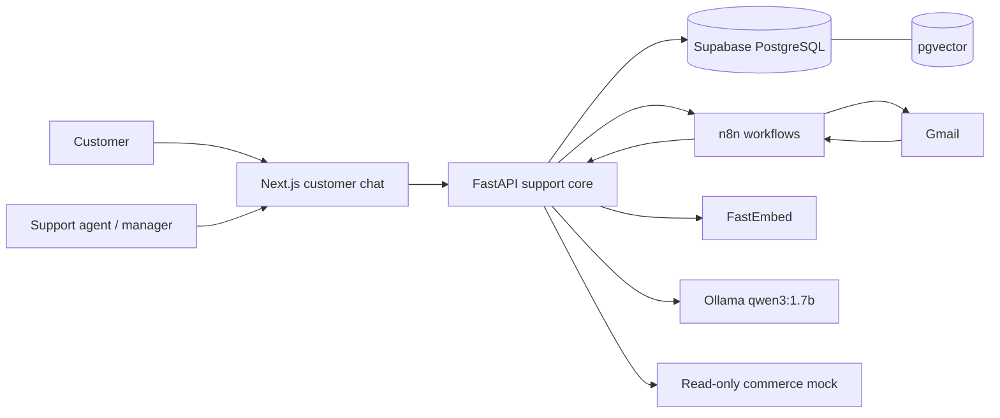
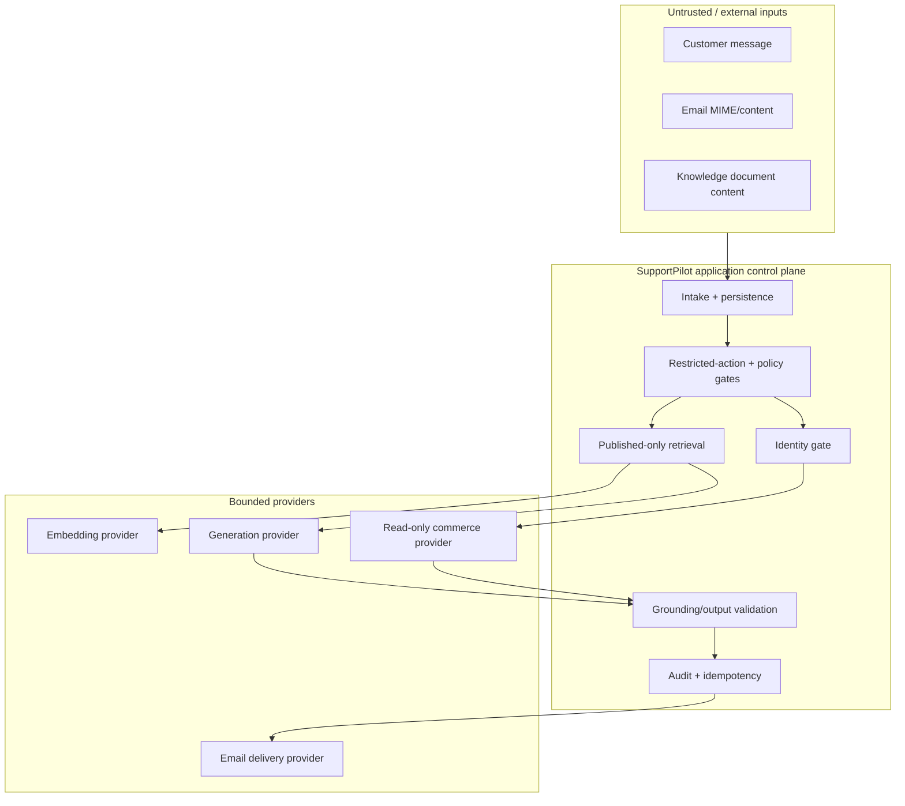
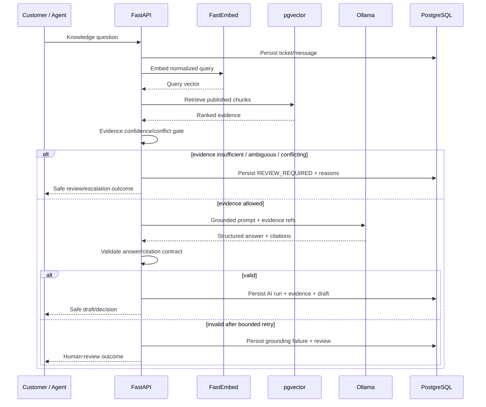
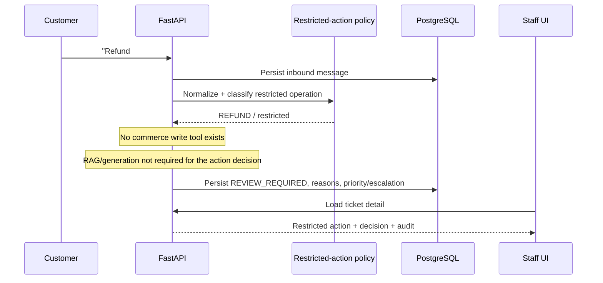
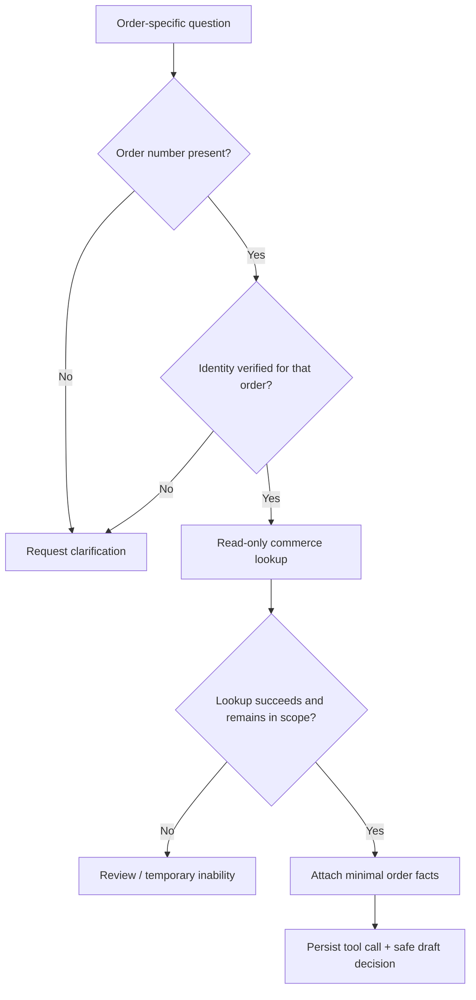
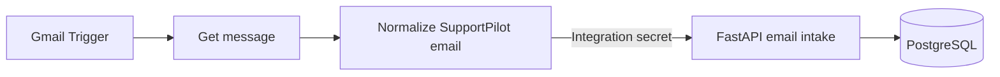
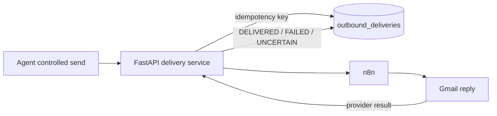

# SupportPilot AI Architecture

This document describes the implemented portfolio architecture for SupportPilot AI. Northstar Commerce Co. is fictional and all public/demo data is synthetic.

## 1. System context

### Responsibilities

| Component | Responsibility |
|---|---|
| Next.js web app | Customer chat, authenticated staff queue, ticket detail, decision/evidence/audit views, operations dashboard |
| FastAPI | Ticket/channel API, safety policy, RAG orchestration, identity verification, commerce lookup, outbound delivery semantics |
| Supabase/PostgreSQL | Auth-linked staff profiles, tickets, messages, knowledge metadata, AI runs, evidence, tool calls, actions, audit events, deliveries |
| pgvector | Similarity retrieval over indexed knowledge chunks |
| FastEmbed | Local embedding provider (`BAAI/bge-small-en-v1.5`) |
| Ollama | Local grounded generation (`qwen3:1.7b`) |
| Commerce mock | Synthetic Shopify-style, read-only customer/order/product facts |
| n8n | Gmail intake/outbound orchestration and local OAuth integration |
| Gmail | Shared-inbox-style intake and demonstrated outbound delivery |

Slack escalation was a SHOULD requirement in the simulated brief and is intentionally documented as deferred rather than claimed as implemented.

## 2. Trust boundaries

Customer messages and retrieved documents are treated as data, not authority. Provider output is not trusted until it satisfies the application's structured contract.

## 3. Knowledge/RAG path

Key properties:

- only published knowledge is retrieved for normal support answers;
- evidence confidence, ambiguity and conflict are application-level signals;
- generation is skipped when evidence does not allow it;
- generation attempts are bounded;
- citations must reference retrieved evidence;
- invalid structured output fails closed.

## 4. Restricted-action path

The AI cannot grant itself refund, cancellation, order-edit, address-change, payment, policy-exception, or replacement authority because those write capabilities do not exist in the MVP tool surface.

## 5. Order-status path

The provider returns a deliberately narrow support view. Cross-customer and failed-verification cases must not expose order contents, fulfillment state, tracking data, or totals.

## 6. Email path

### Intake

### Outbound

Confirmed failure and ambiguous delivery are intentionally distinct. An ambiguous provider result is not silently treated as safe to retry.

## 7. Data and audit model

The core schema includes staff/users, customers, tickets, messages, cached order context, knowledge sources/chunks, AI runs, retrieval evidence, tool calls, agent actions and audit events. Delivery records extend the operational trail for outbound responses.

Material AI decisions persist provider/model/prompt metadata, intent, confidence band, decision reasons, latency/error information and linked evidence/tool activity. Staff actions and ticket transitions are also recorded.

## 8. Security model

- Staff interfaces require authentication.
- Server-side role checks and PostgreSQL RLS protect internal tables.
- Browser-authenticated staff are not given direct mutation authority over sensitive tables; mutations go through API workflows.
- Secrets live in environment/local integration configuration and are excluded from public evidence.
- Commerce is read-only and identity scoped.
- Customer-facing output excludes internal confidence, prompts, tool names and excessive PII.
- Readiness fails closed when core database/vector dependencies are unavailable.

## 9. Provider boundaries

Embeddings, generation and commerce access are abstracted so integration tests can substitute deterministic providers. This is why safety and acceptance gates can be tested without relying on a paid API or nondeterministic external model behavior.

The local demo uses FastEmbed and Ollama. The 384-dimensional native local embedding is adapted to the project's 1536-dimensional vector contract; a production deployment should choose one consistent native dimension/index contract rather than carry this compatibility layer.

## 10. Observed performance

The measured local full grounded RAG decision p95 was about 6.33 seconds, with local model generation accounting for most of the observed latency. Verified commerce decisions were below one second p95 in the captured M6B sample.

These are local portfolio measurements, not production SLAs. See `docs/evidence/milestone-6b-reliability-performance.*` for the recorded report.
